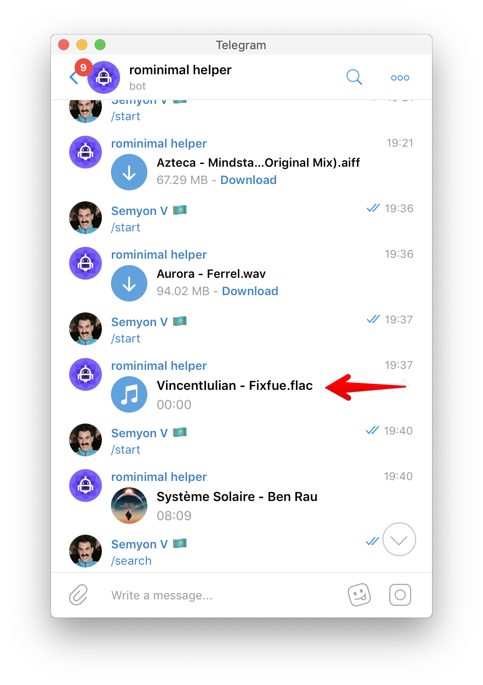
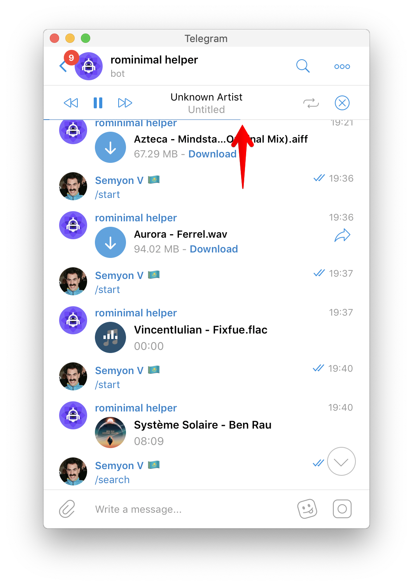

# How to download some audio files in Telegram for Mac

Some audio files in Telegram for Mac are displayed with a note icon \(or rarely with the release cover image\). Such files are just playing and never appear in Downloads folder.

There is a way to download such.

First, let it start playing:

Then wait until loading progress bar reaches the end:

After that right click on the icon will open context menu with "Save as..." option:

Alternatively you can use [Telegram Desktop](https://desktop.telegram.org/) app that has dedicated download icon for audio files.

