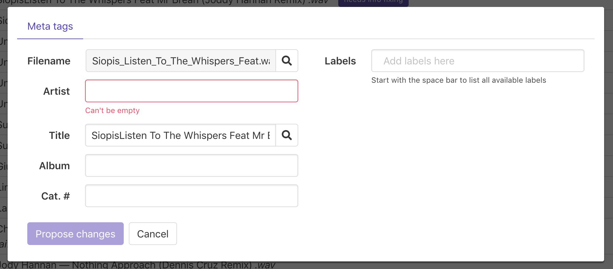
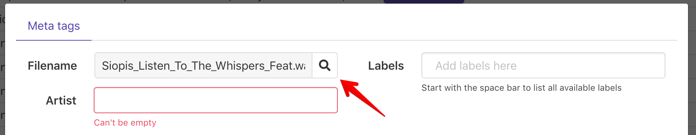
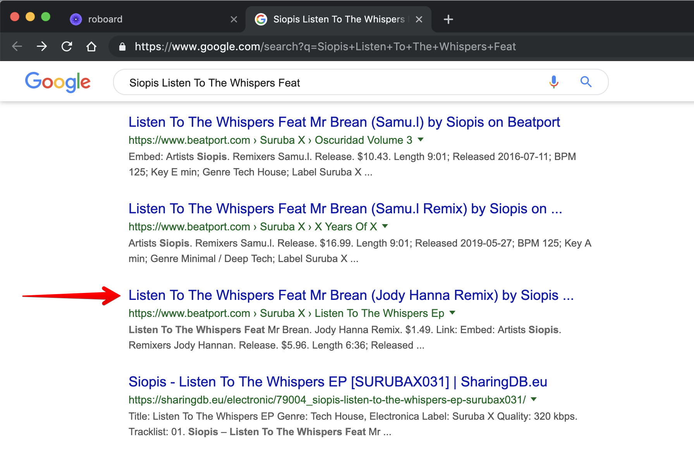
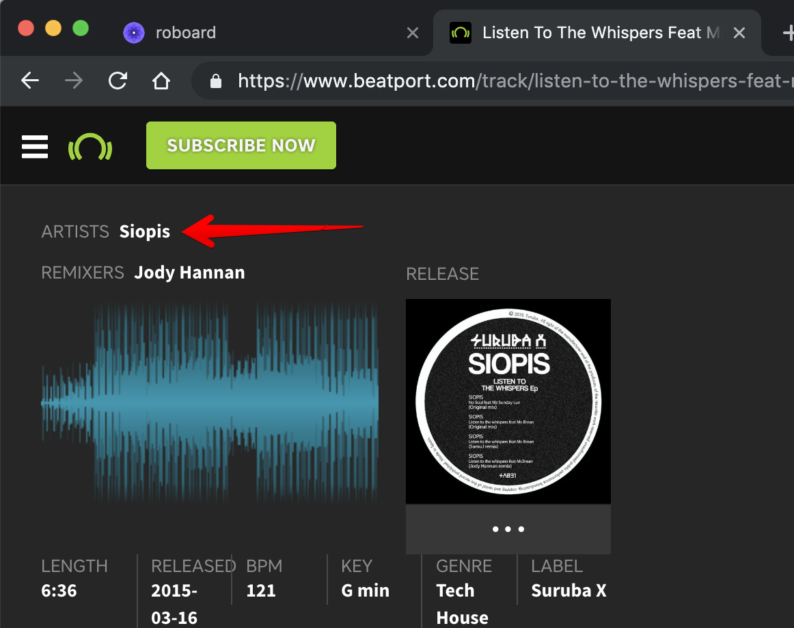
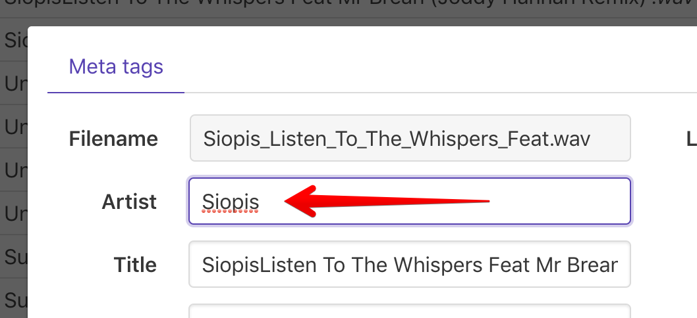
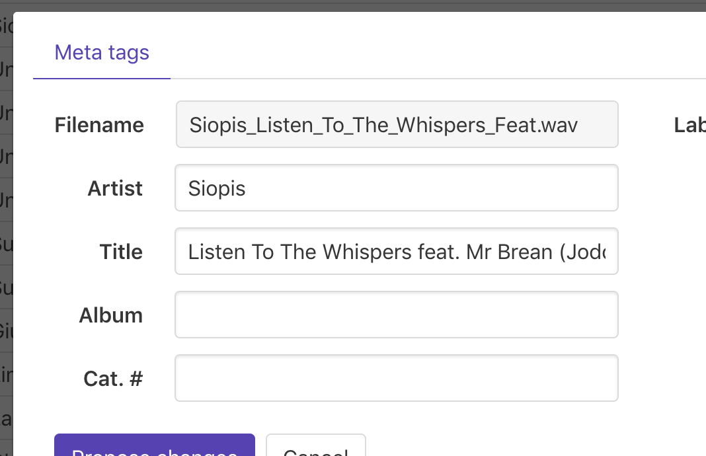
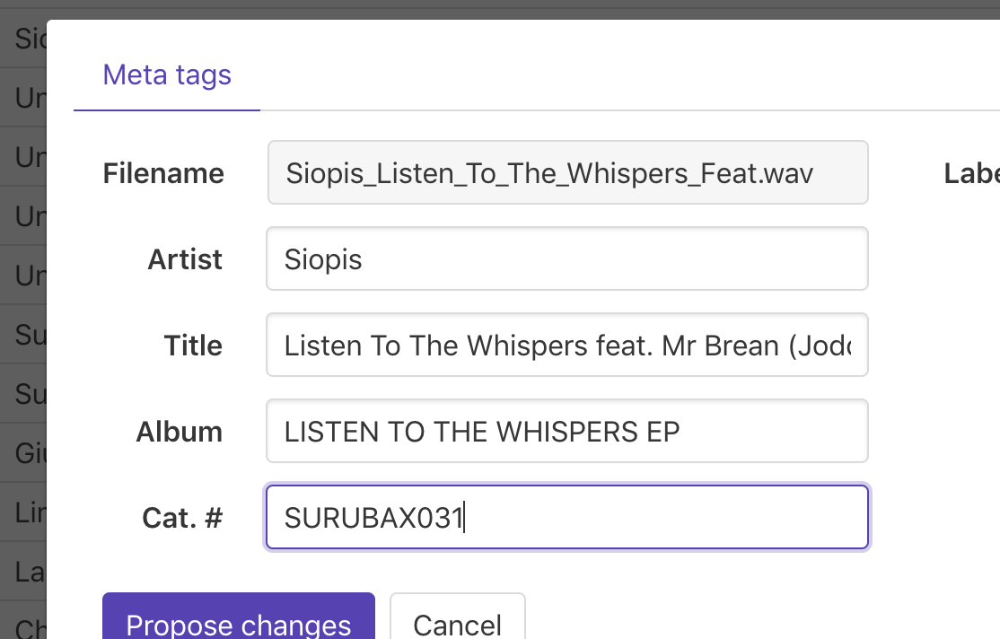
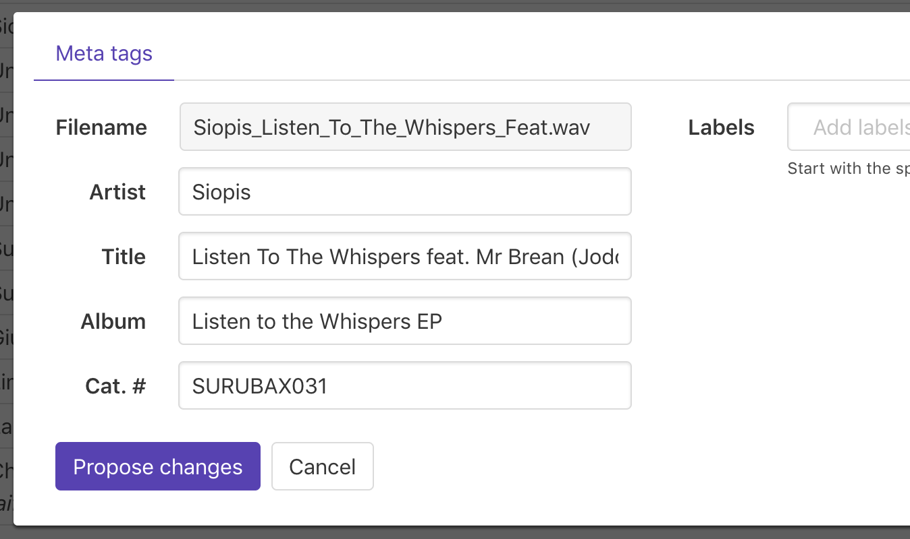

# How to fill-in upload with correct meta-data

Welcome to the most nerdy rominimal group in the Telegram. Here we're extremely peaky to badly tagged uploads.

It's not a huge problem for us when participants are just possessing poorly tagged files, but it becomes one when these files are getting uploaded to the group.

Luckily we have an easy way to fix such uploads.

## What to do?

Assuming you do know what [roboard](https://romnml.rv7.ru) is.

Once logged in you see the feed of uploads:

Some uploads are marked with `needs info fixing` label. These are our enemy.

If you see one, press the pencil icon on the right from upload name:

That opens metadata editing dialog:

If you know where to take correct information for a given upload – that's great, but if you don't, try the lens icon that opens Google search for the filename:

Okay, this must be our guy:

Beatport is not that handy as Discogs when it comes to metadata copying, but good enough for our case. Right from the first page we already know the artist:

Copying it over to upload metadata:

It is CAPS LOCK? No. This is good. Moving over.

Title property now contains the artist in it. This is bad, so removing it:

Before: **SiopisListen To The Whispers Feat Mr Brean \(Joddy Hannan Remix\)** After: **Listen To The Whispers Feat Mr Brean \(Joddy Hannan Remix\)**

Is it good already? No. "Feat" is not part of the featuring artist name and should be just **feat**.

Before: **Listen To The Whispers Feat Mr Brean \(Joddy Hannan Remix\)** After: **Listen To The Whispers feat. Mr Brean \(Joddy Hannan Remix\)**

Is it good already? Joddy in fact is Hanna, not Hannan. Is it that important? YES IT IS!

Before: **Listen To The Whispers feat. Mr Brean \(Joddy Hannan Remix\)** After: **Listen To The Whispers feat. Mr Brean \(Joddy Hanna Remix\)**

Track title contains VINYL ONLY or \(Original Mix\)? No, this is good. But if it does? Then please remove it.

Track title or artist contains unnecessary symbols like "\_"? No, this is good. But if it does? Then please remove it.

Are we there yet:

No. Album and Cat. \# are empty, but Beatport has this information. Going there and copying it over:

Is it good already? NO! ALBUM SHOULDN'T BE IN CAPS LOCK. It's fine if Cat. \# is:

Are we there already? Yes, looks like we are.

Should you fill-in the **labels**? It's not necessary.

## List of the rules for metadata

Please check if your editing satisfies all these rules:

* Artist name, track title or album title ARE WRITTEN NOT IN CAPSLOCK
* Album or Cat. \# are not empty when known
* Track title does not contain unnecessary information like **vinyl only**, **original mix** or **mastered\_M6666**
* Artist name, track title or album does not contain unnecessary symbols, like "\_" \(and as space separator correct symbol is used, which is " "\)
* Artist names are separated by "," or "&" and not "x"

## Other important information

If your proposal for someone's upload is successfully passed moderation you get **0.1 chatles**. Isn't it awesome?

If someone edits your poorly tagged upload, it cost you **0.1 chatles**.

So please keep track on your poorly tagged uploads. [If you see something here please fix it!](https://romnml.rv7.ru/?myUploads=true&badTagged=true)

## Examples of bad tagging

Artist: **Pedro\_Goya\_&\_Magazino**  
Should be: **Pedro Goya & Magazino**  
What's wrong: words are separated with "\_" and not " "

Track title: **barut- lecia vi v2**  
Should be: **Lecia Vi V2**  
What's wrong: Barut is artist name and shouldn't be in title field

Track title: **Unkempt \[FPR006\]**  
Should be: **Unkempt**  
What's wrong: Catalog number in track title

Track title: **B2 Oops I Did it Again**  
Should be: **Oops I Did it Again**  
What's wrong: Track number goes with track title

Filename: Britney Spears - A1 Untitled \[HELL666\].wav  
Track title: **Untitled**  
Should be: **A1** or **A1 Untitled**  
What's wrong: Side is known, so better to keep it

Album: **HOW004**, Cat \#: **Empty**  
Should be: Album: **HOW004** or empty, Cat \#: **HOW004**  
What's wrong: Catalog number is in the wrong field

Track title: **Ricardo Villalobos - Fizheuer Zieheuer \(Original mix\)**  
Should be: **Fizheuer Zieheuer**  
What's wrong: artist name and extraneous information is in the track field

_**Thank you for keeping it clean!**_

