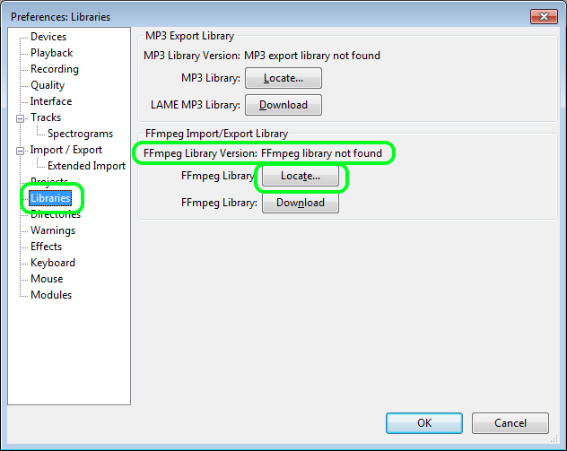

# Audacity

Go to [https://www.audacityteam.org/download/windows/](https://www.audacityteam.org/download/windows/) \(there's a Mac version too which can be installed in the habitual OSX way by unpacking and dropping into Applications. Set up is about the same regarding parameters and values\)**.**

Download the installer \(**Audacity 2.1.2 installer**\) or portable \(**Audacity 2.1.2 zip file**\) version.

The portable version is smaller and contains no help files.

Install or unpack Audacity to the desired location.

Of the audio filetypes allowed on Redacted, only FLAC and MP3 are natively supported by Audacity. To add support for AAC, AC3 and DTS files, you must also install the FFmpeg library. Follow the instructions here to download and install it:  
[https://manual.audacityteam.org/man/faq\_installation\_and\_plug\_ins.html\#ffdown](https://manual.audacityteam.org/man/faq_installation_and_plug_ins.html#ffdown)

Once you've installed both Audacity and the FFmpeg library, launch Audacity.

Open the preferences. Click **Edit**, then **Preferences...** \(Or press **Ctrl+P**\):

In the treebar on the left, click **Tracks**.

Check the box "Automatically fit tracks vertically zoomed"  
Change the **Default View Mode** dropdown from **Waveform** to **Spectrogram**. \(This is optional, but will eliminate the need to manually select Spectrogram from the file menu every time you open a track.\)

Check the box "Select all audio in project, if none selected"

In the treebar on the left, click **Spectrograms**.

Change the options on this screen to the following:

* Scale: Linear
* Minimum Frequency: 0
* Maximum Frequency: 23000
* Gain: 20
* Range: 110 but it'd be preferable 130. 
* Frequency gain: 0
* Algorithm: Frequencies
* Window size: 1024
* Window type: Blackman-Harris
* Zero padding factor: 1

Click **Apply**.

In the treebar on the left, click **Import / Export**.

Under "When importing audio files" make sure the radio button is selected for the option "Make a copy of uncompressed audio files before editing \(safer\)"

In the treebar on the left, click **Libraries**.

If under "FFmpeg Library Import/Export" you do not see "FFmpeg Library Version: FFmpeg library not found" but some version numbers instead, then you should be done setting up Audacity. Click **OK** to save/close the Preferences window.

Otherwise, if you see this:

Then click the **Locate...** button next to "FFmpeg Library."

Hopefully you'll get a popup message of "Success - Audacity has successfully detected valid FFmpeg libraries..." in which case, click **No**.

Otherwise, click **Browse...**, navigate to the folder where you installed **FFmpeg for Audacity**.

Select the **avformat-55.dll** file, then click **Open**, and click **OK**.

You should be done setting up Audacity. Click **OK** to save/close the Preferences window.

